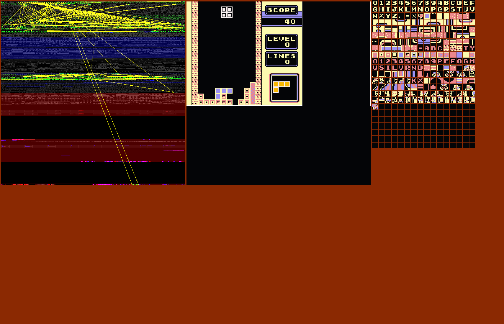
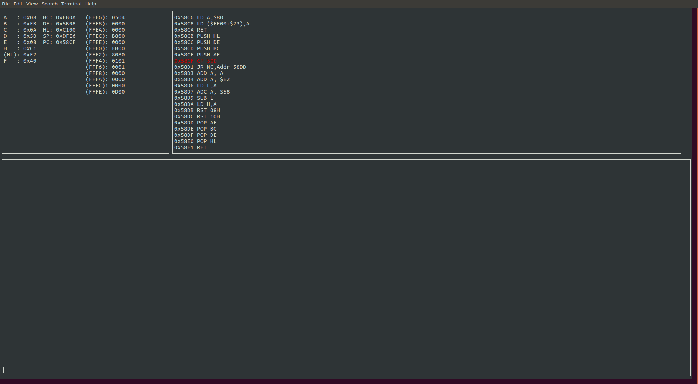

# rusty-boy
[](https://travis-ci.org/MarkMcCaskey/rusty-boy)

A Gameboy emulator and related tools in Rust (with possible rendering also in C).

Making this live on twitch.tv/maoeurk


*Note*: This is under active development and is currently not in the
most usable state.  

Feel free to submit issues and pull requests.

## About

Project done for fun and learning about Rust and complexity management.

Memory visualization inspired by [ICU64 / Frodo Redpill v0.1](https://icu64.blogspot.com/2009/09/first-public-release-of-icu64frodo.html)




## Building

First install `libsdl2-dev`.  If you're new to Rust, install `rustup`
to install `rustc` and `cargo`.

You may need to install ncurses libraries to compile this project.
TODO: test and update this

Then just run:

```
cd rusty-boy
cargo install
```

and you should be up and running.

## Running

To run, run the following command:
```
cargo run --release -- /path/to/rom
```

To run with the TUI debugger, run:
```
cargo run --release --features=debugger -- /path/to/rom -d
```

To run with the assembler and debugger, run:
```
cargo run --release --features="debugger asm" -- /path/to/rom -d
```
